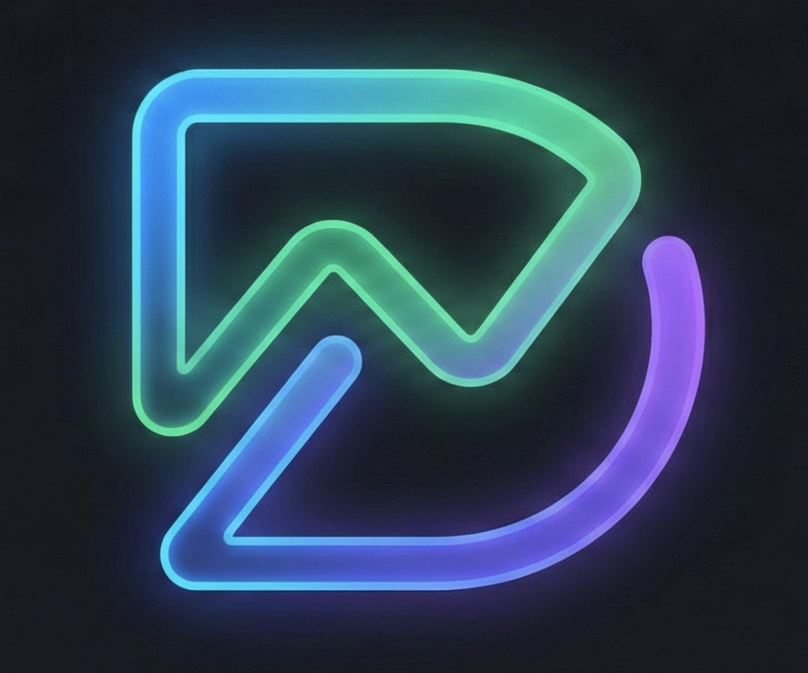

# MyDash - Personal Raspberry Pi Dashboard

A high-contrast, data-dense personal dashboard designed for Raspberry Pi. It visualizes Strava activity data, tracks daily metrics, and manages your schedule with a privacy-focused, self-hosted architecture.



## Features

- **Activity Tracking**: Visualize runs, rides, swims, and gym sessions with Coros-inspired aesthetics.
- **Weekly Analysis**: Heatmap visualization of weekly consistency (Last, Current, and Next Week planning).
- **Planning**: Calendar view for upcoming events and training schedules.
- **Advanced Filtering**: Filter activities by sport type, name, distance, and date range.
- **Privacy First**: Self-hosted on your hardware. Data stays with you.
- **PWA Ready**: Installable on iOS/Android with offline capabilities.

## Prerequisites

Before starting, ensure you have the following installed on your machine (Raspberry Pi, Mac, Windows, or Linux):

1.  **Node.js**: The runtime environment for the application.
    *   **Minimum Version**: v18.0.0
    *   **Check version**: Run `node -v` in your terminal.
    *   *If not installed*: Download from [nodejs.org](https://nodejs.org/) or use a version manager like `nvm` or `fnm`.
2.  **npm (Node Package Manager)**: Usually comes installed with Node.js.
    *   **Check version**: Run `npm -v`.

## Installation & Setup Guide

### 1. Clone the Project
First, get the code onto your local machine.
```bash
git clone https://github.com/yourusername/mydash.git
cd mydash
```

### 2. Install Dependencies
This project relies on several external libraries. You must install them before running the app.
Yes, `npm install` is the correct command! It reads the `package.json` file and downloads the following key technologies into the `node_modules` folder:

*   **react & react-dom**: The core UI framework.
*   **lucide-react**: For the beautiful vector icons.
*   **recharts**: For charting and data visualization.
*   **vite**: The build tool and development server (extremely fast).
*   **tailwindcss**: For utility-first CSS styling.

**Run the command:**
```bash
npm install
```

### 3. Run the Development Server
To see the app running locally with hot-reloading (updates instantly when you save code):

```bash
npm run dev
```

You should see output indicating the server is running, typically at:
**http://localhost:5173** (or a similar port).
Open this URL in your web browser.

### 4. Build for Production (Optional)
If you want to deploy this to a Raspberry Pi or a web server, you should build the optimized static files.

```bash
npm run build
```
This creates a `dist` folder containing the optimized HTML, CSS, and JS files. You can serve this folder using `serve`, `nginx`, or `apache`.

### 5. Running with Docker (Advanced)
If you prefer using Docker to containerize the application (ideal for Raspberry Pi self-hosting):

1.  Ensure **Docker** and **Docker Compose** are installed.
2.  Run the compose command:
    ```bash
    docker-compose up -d --build
    ```
3.  The app will be accessible at `http://raspberrypi.local:3000` (or your device's IP).

## Configuration

Navigate to the **Settings** tab within the application to configure your integrations:
- **Strava Sync**: Enter your Client ID & Secret to fetch activities.
- **Google Services**: Enter credentials for Google Fit (Activity Rings) and Calendar integration.

## Project Structure

```
/mydash
  ├── components/      # React UI components (ActivityList, Heatmap, etc.)
  ├── services/        # Mock data and API services
  ├── types.ts         # TypeScript definitions
  ├── App.tsx          # Main application entry point
  ├── index.html       # HTML entry point
  ├── package.json     # Project dependencies and scripts
  └── vite.config.ts   # Build tool configuration
```
